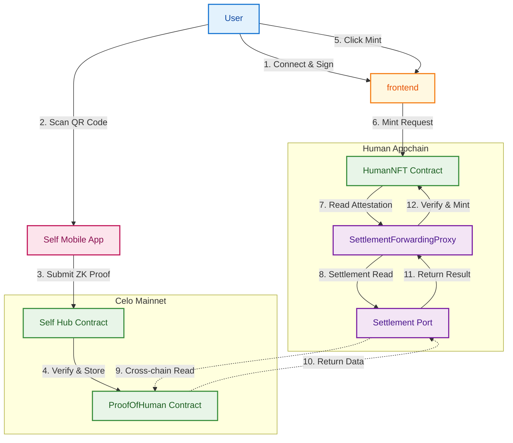

# Self ↔ Pylon Demo

A fully on-chain, privacy-preserving identity attestation system using the Self protocol and Human appchain with **true cross-chain architecture** powered by [Spire's Pylon](https://docs.spire.dev/pylon/).

## Frontend

This project includes a unified frontend application:

**`frontend`**: A unified frontend that combines the complete flow from attestation to NFT minting with automatic network switching and a single flow from wallet connection → attestation → NFT minting.

### Test the Complete Flow

1. **Connect Wallet**: Connect your wallet to start the flow
2. **Generate Signature**: Sign a message to prove address ownership
3. **Scan QR Code**: Use Self app to scan passport and generate proof
4. **Automatic Submission**: Self automatically submits proof to ProofOfHuman contract **on Celo mainnet**
5. **ProofOfHuman**: Binds your wallet address to your passport without revealing passport details
6. **Switch to Human appchain**: The app automatically switches to Human appchain
7. **Claim NFT**: Mint the "I am human" NFT on Human appchain
8. **Cross-Chain Verification**: The HumanNFT contract on Human appchain reads your attestation from Celo via a cross-chain synchronous read call

## Architecture

This system enables:
1. **Users to Maintain privacy** - only cryptographic commitments and ZK proofs are stored on-chain
2. **App devs to defend against sybil attacks** - NFTs can only be claimed once per passport
3. **Celo to act as a user identity hub** - Celo's network effects expand reach for identity-based applications
4. **True cross-chain composability** - Human appchain reads Celo state synchronously via Pylon



## 0. Using Existing Deployment

### Quick Start with Pre-deployed Contracts

If you want to use our existing deployment instead of deploying your own contracts:

```bash
# Install dependencies
pnpm install

# Set environment variables for existing deployment
export SELF_HUB_ADDRESS=0xe57F4773bd9c9d8b6Cd70431117d353298B9f5BF
export SELF_CONFIG_ID=0x7baf7f25b3fe0f6eacb06d67e319140996ad4dd54f00529abf3fea5095f06b72
export SELF_SCOPE=18357982425819932074273780827128310208012362272222002103953286134929761147025
export NEXT_PUBLIC_SELF_SCOPE="self-pylon-demo"

# Celo mainnet configuration
export CELO_RPC_URL=https://forno.celo.org
export CELO_CHAIN_ID=42220
export PROOF_OF_HUMAN_ADDRESS=0x5E05a5CCf9fe3EC0a4b602A56381D685D0f711a8

# Human appchain configuration
export PYLON_RPC_URL=https://pylon.celo-mainnet.spire.dev/v1/chain/2139/rpc
export PYLON_CHAIN_ID=2139
export PYLON_SETTLEMENT_PORT=0x0000000000000000000000000000000000000042
# Celo contract address
# export HUMAN_NFT_ADDRESS=0xE95515970B457130B5D891666e02ABBA49c84448
# Human appchain contract addresses
export SETTLEMENT_FORWARDING_PROXY=0xa0077219389A1aE6c061CCEBDc9760C626dA90B5
export HUMAN_NFT_ADDRESS=0x6DC93BEFC7311089B92A39242411ACd102A0F6f8

# Configure frontend
cat > frontend/.env.local << EOF
NEXT_PUBLIC_CELO_RPC_URL=$CELO_RPC_URL
NEXT_PUBLIC_CELO_CHAIN_ID=$CELO_CHAIN_ID
NEXT_PUBLIC_PROOF_OF_HUMAN_ADDRESS=$PROOF_OF_HUMAN_ADDRESS
NEXT_PUBLIC_SELF_SCOPE=$NEXT_PUBLIC_SELF_SCOPE
NEXT_PUBLIC_PYLON_RPC_URL=$PYLON_RPC_URL
NEXT_PUBLIC_PYLON_CHAIN_ID=$PYLON_CHAIN_ID
NEXT_PUBLIC_HUMAN_NFT_ADDRESS=$HUMAN_NFT_ADDRESS
NEXT_PUBLIC_WALLETCONNECT_PROJECT_ID=your_walletconnect_project_id
EOF

# Replace 'your_walletconnect_project_id' with your actual WalletConnect project ID
# Get your project ID from https://cloud.walletconnect.com/

# Start frontend
pnpm --filter frontend dev
```

**Note**: The existing deployment uses the cross-chain architecture where attestations are on Celo and claims happen on Human appchain via Pylon.


## 1. Deploying the Project

### Prerequisites

```bash
# Install dependencies
pnpm install

# Generate deployer private key
export SIGNER_PRIVATE_KEY=$(cast wallet new | grep "Private key:" | cut -d: -f2 | tr -d ' ')

# Get the public address from the private key
export SIGNER_ADDRESS=$(cast wallet address --private-key $SIGNER_PRIVATE_KEY)

echo "Private key: $SIGNER_PRIVATE_KEY"
echo "Address: $SIGNER_ADDRESS"

# Ensure account has funds for deployment gas fees
```

### Network Configuration

```bash
# Celo mainnet - where attestations are stored
export CELO_RPC_URL="https://forno.celo.org"
export CELO_CHAIN_ID=42220

# Human appchain - where claims happen
export PYLON_RPC_URL="https://pylon.celo-mainnet.spire.dev/v1/chain/2139/rpc"
export PYLON_CHAIN_ID=2139

# Pylon settlement port - enables cross-chain reads from Celo
export PYLON_SETTLEMENT_PORT="0x0000000000000000000000000000000000000042"

# Self Hub contract (official Self contract on Celo)
export SELF_HUB_ADDRESS=0xe57F4773bd9c9d8b6Cd70431117d353298B9f5BF
```

**Verify Configuration**:
```bash
# Check Celo connectivity
cast block-number --rpc-url $CELO_RPC_URL

# Check Human appchain connectivity and verify chain ID
cast block-number --rpc-url $PYLON_RPC_URL
cast chain-id --rpc-url $PYLON_RPC_URL  # Should return: 2139

# Verify settlement port contract exists
cast code $PYLON_SETTLEMENT_PORT --rpc-url $PYLON_RPC_URL

# Verify Pylon is synced with Celo
curl -s https://pylon.celo-mainnet.spire.dev/_status/ready | jq
```

## 2. ProofOfHuman Setup

### 2a. Using Existing Deployment

Skip to section 3 if using our existing ProofOfHuman contract.

### 2b. Deploying ProofOfHuman for First Time

#### Generate Self Configuration

1. Visit [Self's configuration interface](https://tools.self.xyz/)
2. Set verification requirements:
   - Minimum age: 18
   - Enable OFAC 1 and OFAC 2 sanctions checks
3. Submit to get your `configId`
4. Generate a scope seed for frontend

The Self configuration tool will:
- Deploy a new configuration if one doesn't exist for your chosen settings
- Provide you with a `configId` (bytes32) and `scope` (uint256)
- Allow you to customize verification parameters through the UI

**Note**: If you prefer to deploy the configuration from the terminal instead of the UI, you can use the CLI instead.

```bash
# After using the Self configuration tool, set the generated values
# Replace these with the actual values from your Self configuration
export SELF_CONFIG_ID=<your_generated_config_id>
export NEXT_PUBLIC_SELF_SCOPE="<your_scope_seed>"
export SELF_SCOPE=<your_generated_scope_value>

# Example of what these might look like:
# export SELF_CONFIG_ID=0x7baf7f25b3fe0f6eacb06d67e319140996ad4dd54f00529abf3fea5095f06b72
# export NEXT_PUBLIC_SELF_SCOPE="my-custom-demo"
# export SELF_SCOPE=6477103330237602230352812949141264605456698243037569300666502678848111318328
```

#### Configure Self Hub Contract

```bash
# Set verification configuration on Self's Hub contract on Celo
cast send $SELF_HUB_ADDRESS \
"setVerificationConfigV2((bool,uint256,bool,uint256[4],bool[3]))" \
"(true,18,false,[0,0,0,0],[true,true,false])" \
--rpc-url $CELO_RPC_URL \
--private-key $SIGNER_PRIVATE_KEY

# Parameter breakdown:
# config.olderThanEnabled: true (enable age verification)
# config.olderThan: 18 (minimum age requirement)
# config.forbiddenCountriesEnabled: false (disable country restrictions)
# config.forbiddenCountriesListPacked: [0,0,0,0] (no forbidden countries)
# config.ofacEnabled: [true,true,false] (enable OFAC 1 & 2, disable OFAC 3)
```

#### Deploy ProofOfHuman Contract

```bash
# Deploy the contract on Celo mainnet
pushd contracts
forge script script/DeployHubRoot.s.sol:DeployHubRoot \
  --rpc-url $CELO_RPC_URL \
  --broadcast \
  --private-key $SIGNER_PRIVATE_KEY
popd

# Get the deployed address
latest=$(find contracts/broadcast/DeployHubRoot.s.sol/$CELO_CHAIN_ID -name "run-latest.json" -type f)
lowercase_addr=$(jq -r '.transactions[] | select(.contractName=="ProofOfHuman") | .contractAddress' "$latest")
export PROOF_OF_HUMAN_ADDRESS=$(cast to-check-sum-address $lowercase_addr)
echo "ProofOfHuman deployed on Celo at: $PROOF_OF_HUMAN_ADDRESS"
```

#### Set Scope and ConfigId

```bash
# Set the scope and configId on your ProofOfHuman contract on Celo
cast send $PROOF_OF_HUMAN_ADDRESS \
"setScope(uint256)" \
"$SELF_SCOPE" \
--rpc-url $CELO_RPC_URL \
--private-key $SIGNER_PRIVATE_KEY

cast send $PROOF_OF_HUMAN_ADDRESS \
"setConfigId(bytes32)" \
"$SELF_CONFIG_ID" \
--rpc-url $CELO_RPC_URL \
--private-key $SIGNER_PRIVATE_KEY
```

## 3. HumanNFT Setup on Human Appchain

### 3a. Using Existing Deployment

Skip to section 4 if using our existing HumanNFT contract.

### 3b. Deploying HumanNFT for First Time

**Important**: This deployment creates both the SettlementForwardingProxy and HumanNFT on Human appchain. The proxy enables cross-chain reads from Celo via Pylon.

```bash
export PYLON_SETTLEMENT_PORT="0x0000000000000000000000000000000000000042"

# Deploy on Human appchain (deploys both SettlementForwardingProxy and HumanNFT)
pushd contracts
forge script script/DeployPylon.s.sol:DeployPylon \
  --rpc-url $PYLON_RPC_URL \
  --broadcast \
  --private-key $SIGNER_PRIVATE_KEY
popd

# Get the deployed addresses
latest=$(find contracts/broadcast/DeployPylon.s.sol/$PYLON_CHAIN_ID -name "run-latest.json" -type f)

# Get SettlementForwardingProxy address
lowercase_proxy=$(jq -r '.transactions[] | select(.contractName=="SettlementForwardingProxy") | .contractAddress' "$latest")
export PROOF_OF_HUMAN_PROXY=$(cast to-check-sum-address $lowercase_proxy)
echo "SettlementForwardingProxy deployed on Human appchain at: $PROOF_OF_HUMAN_PROXY"

# Get HumanNFT address
lowercase_nft=$(jq -r '.transactions[] | select(.contractName=="HumanNFT") | .contractAddress' "$latest")
export HUMAN_NFT_ADDRESS=$(cast to-check-sum-address $lowercase_nft)
echo "HumanNFT deployed on Human appchain at: $HUMAN_NFT_ADDRESS"
echo ""
echo "✅ Cross-chain setup complete"'!'
echo "   - Attestations are stored on Celo: ${PROOF_OF_HUMAN_ADDRESS}"
echo "   - Claims happen on Human appchain: $HUMAN_NFT_ADDRESS"
echo "   - Settlement proxy on Human appchain: $PROOF_OF_HUMAN_PROXY"
```

## 4. Configure Frontend

The frontend requires a `frontend/.env.local` file with all environment variables before building or running. This file is created below:

```bash
# Configure frontend (complete flow in one app)
cat > frontend/.env.local << EOF
NEXT_PUBLIC_CELO_RPC_URL=$CELO_RPC_URL
NEXT_PUBLIC_CELO_CHAIN_ID=$CELO_CHAIN_ID
NEXT_PUBLIC_PROOF_OF_HUMAN_ADDRESS=$PROOF_OF_HUMAN_ADDRESS
NEXT_PUBLIC_SELF_SCOPE=$NEXT_PUBLIC_SELF_SCOPE
NEXT_PUBLIC_PYLON_RPC_URL=$PYLON_RPC_URL
NEXT_PUBLIC_PYLON_CHAIN_ID=$PYLON_CHAIN_ID
NEXT_PUBLIC_HUMAN_NFT_ADDRESS=$HUMAN_NFT_ADDRESS
NEXT_PUBLIC_WALLETCONNECT_PROJECT_ID=your_walletconnect_project_id
EOF

# Replace 'your_walletconnect_project_id' with your actual WalletConnect project ID
# Get your project ID from https://cloud.walletconnect.com/

echo "✅ Frontend configured"'!'
echo "   - frontend supports both Celo (chain $CELO_CHAIN_ID) and Human appchain (chain $PYLON_CHAIN_ID)"
echo "   - Complete flow: attestation → NFT minting"

# Build the frontend
# Note: For deployment using GitHub Pages, use ./scripts/build-frontend.sh
pnpm --filter frontend build
```

## 5. Run the Project

Ensure `frontend/.env.local` is configured (see section 4) before running. By default, the app runs with an empty basePath (for custom domain deployment). To run locally:

```bash
# Start frontend (complete flow in one app)
# Access at: http://localhost:3000/
pnpm --filter frontend dev
```

**Custom Base Path**

To run with a basePath (e.g., for testing repository path deployment):

```bash
# Set custom basePath (must start with /)
export NEXT_PUBLIC_BASE_PATH="/self-pylon-demo"

# Start the dev server
# Access at: http://localhost:3000/self-pylon-demo/
pnpm --filter frontend dev
```

**Important**: When running locally with a basePath, you must access the app at `http://localhost:PORT/basePath/` (not at the root). All assets and routes will be prefixed with the basePath. If basePath is empty, access the app at the root URL.

## Deployment

### GitHub Pages Deployment (Recommended)

Before building, ensure `frontend/.env.local` is configured with all required environment variables. You can copy `frontend/.env.local.example` as a template. The app will not function correctly without these values.

1. **Build the static site** (default basePath is empty for custom domain deployment):
   ```bash
   cd ..
   ./scripts/build-frontend.sh
   ```

   **For Custom Domain** (e.g., `human.spire.dev`):
   ```bash
   GITHUB_PAGES_CUSTOM_DOMAIN="human.spire.dev" ./scripts/build-frontend.sh
   ```
   - The build script will automatically create a `CNAME` file in the `docs/` folder with your custom domain
   - The default build uses an empty basePath, which is correct for custom domains
   - After building, configure your custom domain in GitHub Pages settings
   - Set up DNS CNAME record pointing your subdomain to your GitHub Pages domain
   - Your site will be available at `https://human.spire.dev/`

   **For Repository Path Deployment** (e.g., `username.github.io/self-pylon-demo/`):
   ```bash
   NEXT_PUBLIC_BASE_PATH="/self-pylon-demo" ./scripts/build-frontend.sh
   ```
   
   The `NEXT_PUBLIC_BASE_PATH` environment variable controls the basePath used in production. If not set, it defaults to empty (for custom domain deployment).

2. **Commit and push**:
   ```bash
   git add docs/
   git commit -m "Deploy: Update frontend to GitHub Pages"
   git push origin main
   ```

3. **Enable GitHub Pages** in your repo settings:
   - Go to Settings → Pages
   - Source: "Deploy from a branch"
   - Branch: `main`
   - Folder: `/docs`
   - **For custom domain**: Enter your custom domain (e.g., `human.spire.dev`) in the "Custom domain" field

Your unified app will be available at:
- `https://your-custom-domain.com/` (if using custom domain with empty basePath)
- `https://yourusername.github.io/self-pylon-demo/` (if using repository path with basePath set)

**Note**: 
- The default basePath is empty, which is suitable for custom domain deployment (e.g., `human.spire.dev`)
- To use a repository path, set `NEXT_PUBLIC_BASE_PATH` to match your repository name
- The basePath is configured in `frontend/next.config.mjs` and can be overridden with the `NEXT_PUBLIC_BASE_PATH` environment variable

## Important Notes

### Cross-Chain Architecture

This demo uses **[Pylon](https://docs.spire.dev/pylon/)** for synchronous cross-chain reads:

1. **ProofOfHuman on Celo**: Stores attestations on Celo mainnet
2. **SettlementForwardingProxy on Human appchain**: Deployed on Human appchain, forwards calls to Settlement Port
3. **Settlement Port on Human appchain**: Fixed address `0x0000000000000000000000000000000000000042` - reads state from Celo synchronously via Pylon
4. **HumanNFT on Human appchain**: Uses the proxy to verify attestations during minting

From the HumanNFT contract's perspective, it calls a local contract (the proxy), but the data is actually being read from Celo synchronously.

**Human Appchain Status**: You can verify the Human appchain is operational at [https://pylon.celo-mainnet.spire.dev/_status/ready](https://pylon.celo-mainnet.spire.dev/_status/ready)

### Address Casing for Self Protocol

⚠️ **CRITICAL**: Self's proof system is case-sensitive for contract addresses. Always use checksummed addresses:

```bash
# ❌ Wrong - lowercase address from Foundry
export PROOF_OF_HUMAN_ADDRESS=0xf3d2672c6321311e4e7606fb081e59a08c43abad

# ✅ Correct - checksummed address for Self
export PROOF_OF_HUMAN_ADDRESS=$(cast to-check-sum-address 0xf3d2672c6321311e4e7606fb081e59a08c43abad)
```

## Troubleshooting

### ScopeMismatch Error

**Symptoms**: `ScopeMismatch: scope in header doesn't match scope in proof`

**Solution**: Ensure you have set the Scope on the ProofOfHuman contract and that the casing matches between the frontend and contract deployment.

### Minting Issues

**If minting fails, check**:
1. **Attestation completed on Celo**: Complete the attestation process using frontend first
2. **Connected to correct network**: Ensure your wallet is connected to Human appchain (chain ID 2139)
3. **Settlement proxy deployed**: The SettlementForwardingProxy must be deployed on Human appchain
4. **Cross-chain read working**: Pylon must be able to read from Celo

**Debug Steps**:
```bash
# Check environment variables
echo "HumanNFT Address (Human appchain): $HUMAN_NFT_ADDRESS"
echo "ProofOfHuman Address (Celo): $PROOF_OF_HUMAN_ADDRESS"
echo "Human appchain RPC: $PYLON_RPC_URL"
echo "Celo RPC: $CELO_RPC_URL"

# Verify contracts exist
echo "Checking HumanNFT on Human appchain..."
cast code $HUMAN_NFT_ADDRESS --rpc-url $PYLON_RPC_URL

echo "Checking ProofOfHuman on Celo..."
cast code $PROOF_OF_HUMAN_ADDRESS --rpc-url $CELO_RPC_URL

# Check if address is attested on Celo
cast call $PROOF_OF_HUMAN_ADDRESS \
  "addressToNullifier(address)(uint256)" \
  <your_address> \
  --rpc-url $CELO_RPC_URL
```

**Solutions**:
1. **Complete attestation on Celo**: Use the frontend to generate and submit proof on Celo before attempting to mint
2. **Verify network connection**: Ensure your wallet is connected to Human appchain (chain ID 2139)
3. **Check contract deployment**: Verify SettlementForwardingProxy and HumanNFT are deployed on Human appchain
4. **Verify cross-chain configuration**: Ensure `PYLON_SETTLEMENT_PORT` is set to `0x0000000000000000000000000000000000000042` and ProofOfHuman address is correctly configured in the proxy

### Cross-Chain Read Issues

**If the cross-chain read fails**:
1. **Settlement Port address**: Verify it's set to `0x0000000000000000000000000000000000000042` (fixed address on all Human appchains)
2. **Network connectivity**: Ensure both Celo and Human appchain RPC endpoints are accessible
3. **Contract configuration**: Verify ProofOfHuman address is correctly set in the SettlementForwardingProxy
4. **Human appchain status**: Check [https://pylon.celo-mainnet.spire.dev/_status/ready](https://pylon.celo-mainnet.spire.dev/_status/ready) to verify Human appchain is operational
