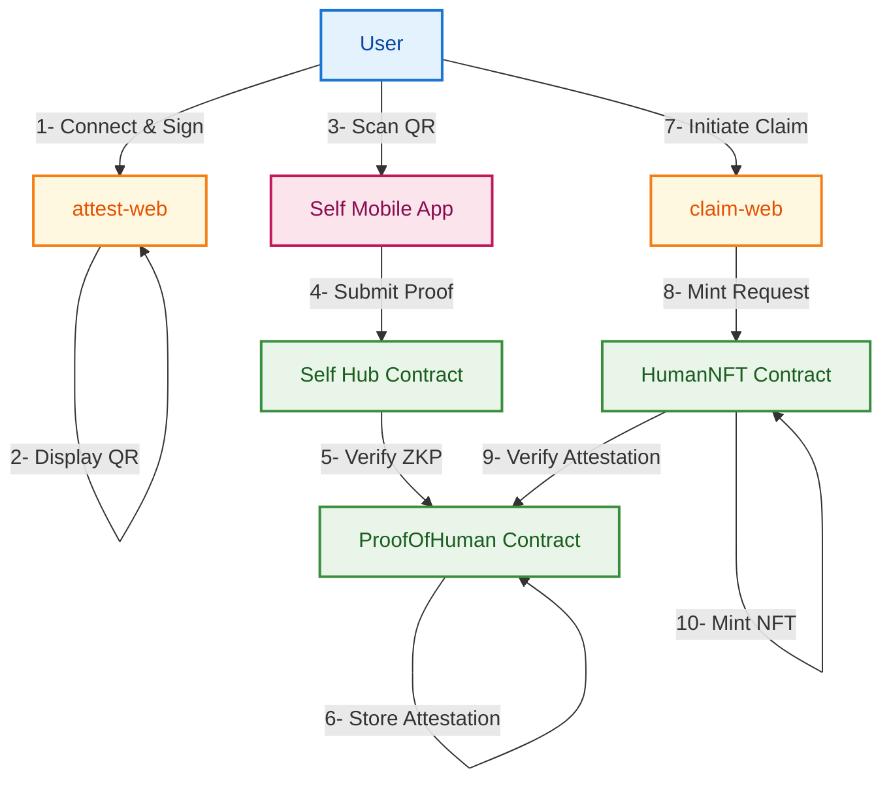

# Self ↔ Pylon Demo

A fully on-chain, privacy-preserving identity attestation system using the Self protocol and Pylon appchain.

### Test the Complete Flow

1. **Connect Wallet**: Connect your wallet to get your address
2. **Generate Signature**: Sign a message to prove address ownership
3. **Scan QR Code**: Use Self app to scan passport and generate proof of passport
4. **Automatic Submission**: Self automatically submits proof to ProofOfHuman contract on Celo's L2
5. **ProofOfHuman**: Binds your public wallet address to your passport without revealing passport details
6. **Claim NFT**: Visit claim-web which runs on its own Pylon appchain and attempt to mint the "I am human" NFT which will execute a synchronous cross-chain call to the ProofOfHuman contract on Celo's L2 to verify and approve the mint request

## Architecture

This system enables:
1. **Users to Maintain privacy** - only cryptographic commitments and ZK proofs are stored on-chain
2. **App devs to defend against sybil attacks** - NFTs can only be claimed once per passport
3. **Celo to act as a user identity hub** - Celo's network effects expand their reach making it a more attractive deployment target



## 0. Using Existing Deployment

### Quick Start with Pre-deployed Contracts

If you want to use our existing deployment instead of deploying your own contracts:

```bash
# Install dependencies
pnpm install

# Set environment variables for existing deployment
export SELF_HUB_ADDRESS=0xe57F4773bd9c9d8b6Cd70431117d353298B9f5BF
export SELF_CONFIG_ID=0x7baf7f25b3fe0f6eacb06d67e319140996ad4dd54f00529abf3fea5095f06b72
export SELF_SCOPE=18357982425819932074273780827128310208012362272222002103953286134929761147025
export NEXT_PUBLIC_SELF_SCOPE="self-pylon-demo"
export CELO_L2_RPC_URL=https://forno.celo.org
export CELO_L2_CHAIN_ID=42220
export PYLON_RPC_URL=https://pylon.celo-mainnet.spire.dev
export PYLON_CHAIN_ID=2139
export PROOF_OF_HUMAN_ADDRESS=0x5E05a5CCf9fe3EC0a4b602A56381D685D0f711a8
export HUMAN_NFT_ADDRESS=0xE95515970B457130B5D891666e02ABBA49c84448

# Configure frontend
cat > apps/attest-web/.env.local << EOF
NEXT_PUBLIC_CELO_L2_RPC_URL=$CELO_L2_RPC_URL
NEXT_PUBLIC_PROOF_OF_HUMAN_ADDRESS=$PROOF_OF_HUMAN_ADDRESS
NEXT_PUBLIC_SELF_SCOPE=$NEXT_PUBLIC_SELF_SCOPE
NEXT_PUBLIC_WALLETCONNECT_PROJECT_ID=your_walletconnect_project_id
EOF

cat > apps/claim-web/.env.local << EOF
NEXT_PUBLIC_PYLON_RPC_URL=$PYLON_RPC_URL
NEXT_PUBLIC_PYLON_CHAIN_ID=$PYLON_CHAIN_ID
NEXT_PUBLIC_HUMAN_NFT_ADDRESS=$HUMAN_NFT_ADDRESS
NEXT_PUBLIC_WALLETCONNECT_PROJECT_ID=your_walletconnect_project_id
EOF

# Start both apps simultaneously
pnpm --parallel --filter attest-web --filter claim-web dev
```


## 1. Deploying the Project

### Prerequisites

```bash
# Install dependencies
pnpm install

# Generate deployer private key
export SIGNER_PRIVATE_KEY=$(cast wallet new | grep "Private key:" | cut -d: -f2 | tr -d ' ')

# Get the public address from the private key
export SIGNER_ADDRESS=$(cast wallet address --private-key $SIGNER_PRIVATE_KEY)

echo "Private key: $SIGNER_PRIVATE_KEY"
echo "Address: $SIGNER_ADDRESS"

# Ensure account has funds for deployment gas fees
```

### Network Configuration

```bash
# Celo mainnet
export CELO_L2_RPC_URL="https://forno.celo.org"
export CELO_L2_CHAIN_ID=42220

# Pylon appchain
export PYLON_RPC_URL="https://pylon.celo-mainnet.spire.dev"
export PYLON_CHAIN_ID=2139

# Self Hub contract (official Self contract)
export SELF_HUB_ADDRESS=0xe57F4773bd9c9d8b6Cd70431117d353298B9f5BF
```

## 2. ProofOfHuman Setup

### 2a. Using Existing Deployment

Skip to section 3 if using our existing ProofOfHuman contract.

### 2b. Deploying ProofOfHuman for First Time

#### Generate Self Configuration

1. Visit [Self's configuration interface](https://app.self.xyz/configure)
2. Set verification requirements:
   - Minimum age: 18
   - Enable OFAC 1 and OFAC 2 sanctions checks
3. Submit to get your `configId`
4. Generate a scope seed for frontend

The Self configuration tool will:
- Deploy a new configuration if one doesn't exist for your chosen settings
- Provide you with a `configId` (bytes32) and `scope` (uint256)
- Allow you to customize verification parameters through the UI

**Note**: If you prefer to deploy the configuration from the terminal instead of the UI, you can use the CLI instead.

```bash
# After using the Self configuration tool, set the generated values
# Replace these with the actual values from your Self configuration
export SELF_CONFIG_ID=<your_generated_config_id>
export NEXT_PUBLIC_SELF_SCOPE="<your_scope_seed>"
export SELF_SCOPE=<your_generated_scope_value>

# Example of what these might look like:
# export SELF_CONFIG_ID=0x7baf7f25b3fe0f6eacb06d67e319140996ad4dd54f00529abf3fea5095f06b72
# export NEXT_PUBLIC_SELF_SCOPE="my-custom-demo"
# export SELF_SCOPE=6477103330237602230352812949141264605456698243037569300666502678848111318328
```

#### Configure Self Hub Contract

```bash
# Set verification configuration on Self's Hub contract
cast send $SELF_HUB_ADDRESS \
"setVerificationConfigV2((bool,uint256,bool,uint256[4],bool[3]))" \
"(true,18,false,[0,0,0,0],[true,true,false])" \
--rpc-url $CELO_L2_RPC_URL \
--private-key $SIGNER_PRIVATE_KEY

# Parameter breakdown:
# config.olderThanEnabled: true (enable age verification)
# config.olderThan: 18 (minimum age requirement)
# config.forbiddenCountriesEnabled: false (disable country restrictions)
# config.forbiddenCountriesListPacked: [0,0,0,0] (no forbidden countries)
# config.ofacEnabled: [true,true,false] (enable OFAC 1 & 2, disable OFAC 3)
```

#### Deploy ProofOfHuman Contract

```bash
# Deploy the contract (temporarily change to contracts directory)
pushd contracts
forge script script/DeployHubRoot.s.sol:DeployHubRoot \
  --rpc-url $CELO_L2_RPC_URL \
  --broadcast \
  --private-key $SIGNER_PRIVATE_KEY
popd

# Get the deployed address
latest=$(find contracts/broadcast/DeployHubRoot.s.sol/$CELO_L2_CHAIN_ID -name "run-latest.json" -type f)
lowercase_addr=$(jq -r '.transactions[] | select(.contractName=="ProofOfHuman") | .contractAddress' "$latest")
export PROOF_OF_HUMAN_ADDRESS=$(cast to-check-sum-address $lowercase_addr)
echo "ProofOfHuman deployed at: $PROOF_OF_HUMAN_ADDRESS"
```

#### Set Scope and ConfigId

```bash
# Set the scope and configId on your ProofOfHuman contract
cast send $PROOF_OF_HUMAN_ADDRESS \
"setScope(uint256)" \
"$SELF_SCOPE" \
--rpc-url $CELO_L2_RPC_URL \
--private-key $SIGNER_PRIVATE_KEY

cast send $PROOF_OF_HUMAN_ADDRESS \
"setConfigId(bytes32)" \
"$SELF_CONFIG_ID" \
--rpc-url $CELO_L2_RPC_URL \
--private-key $SIGNER_PRIVATE_KEY
```

## 3. HumanNFT Setup

### 3a. Using Existing Deployment

Skip to section 4 if using our existing HumanNFT contract.

### 3b. Deploying HumanNFT for First Time

```bash
# Deploy HumanNFT contract (temporarily change to contracts directory)
pushd contracts
forge script script/DeployPylon.s.sol:DeployPylon \
  --rpc-url $PYLON_RPC_URL \
  --broadcast \
  --private-key $SIGNER_PRIVATE_KEY
popd

# Get the deployed address
latest=$(find contracts/broadcast/DeployPylon.s.sol/$PYLON_CHAIN_ID -name "run-latest.json" -type f)
lowercase_addr=$(jq -r '.transactions[] | select(.contractName=="HumanNFT") | .contractAddress' "$latest")
export HUMAN_NFT_ADDRESS=$(cast to-check-sum-address $lowercase_addr)
echo "HumanNFT deployed at: $HUMAN_NFT_ADDRESS"
```

## 4. Configure Frontend

```bash
# Generate .env.local files
cat > apps/attest-web/.env.local << EOF
NEXT_PUBLIC_CELO_L2_RPC_URL=$CELO_L2_RPC_URL
NEXT_PUBLIC_PROOF_OF_HUMAN_ADDRESS=$PROOF_OF_HUMAN_ADDRESS
NEXT_PUBLIC_SELF_SCOPE=$NEXT_PUBLIC_SELF_SCOPE
NEXT_PUBLIC_WALLETCONNECT_PROJECT_ID=your_walletconnect_project_id
EOF

cat > apps/claim-web/.env.local << EOF
NEXT_PUBLIC_PYLON_RPC_URL=$PYLON_RPC_URL
NEXT_PUBLIC_PYLON_CHAIN_ID=$PYLON_CHAIN_ID
NEXT_PUBLIC_HUMAN_NFT_ADDRESS=$HUMAN_NFT_ADDRESS
NEXT_PUBLIC_WALLETCONNECT_PROJECT_ID=your_walletconnect_project_id
EOF

# Build static sites
pnpm --filter attest-web build
pnpm --filter claim-web build
```

## 5. Run the Project

```bash
# Option 1: Start both apps simultaneously using pnpm parallel execution
pnpm --parallel --filter attest-web --filter claim-web dev

# Option 2: Start them in separate terminals (recommended for development)
# Terminal 1: attest-web
pnpm --filter attest-web dev

# Terminal 2: claim-web  
pnpm --filter claim-web dev

# Option 3: Use tmux/screen to manage multiple terminals
# tmux new-session -d -s demo
# tmux send-keys -t demo:0 "pnpm --filter attest-web dev" Enter
# tmux split-window -h
# tmux send-keys -t demo:1 "pnpm --filter claim-web dev" Enter
# tmux attach-session -t demo
```

## Important Notes

### Address Casing for Self Protocol

⚠️ **CRITICAL**: Self's proof system is case-sensitive for contract addresses. Always use checksummed addresses:

```bash
# ❌ Wrong - lowercase address from Foundry
export PROOF_OF_HUMAN_ADDRESS=0xf3d2672c6321311e4e7606fb081e59a08c43abad

# ✅ Correct - checksummed address for Self
export PROOF_OF_HUMAN_ADDRESS=$(cast to-check-sum-address 0xf3d2672c6321311e4e7606fb081e59a08c43abad)
```

## Troubleshooting

### ScopeMismatch Error

**Symptoms**: `ScopeMismatch: scope in header doesn't match scope in proof`

**Solution**: Ensure you have set the Scope on the ProofOfHuman contract and that the casing matches between the frontend and contract deployment.

### Signature Generation Issues

**Solutions**:
1. Ensure wallet is connected and address is available
2. Check wallet permissions for message signing
3. Verify network connection
4. Refresh page if wallet state gets stuck

### Minting Issues

**If minting fails, check**:
1. **HumanNFT contract deployed**: Ensure `HUMAN_NFT_ADDRESS` is set correctly
2. **ProofOfHuman contract set**: The address is automatically set during deployment
3. **Attestation completed**: Complete the attestation process using attest-web first
4. **Pylon configuration**: Check `NEXT_PUBLIC_PYLON_RPC_URL` and `NEXT_PUBLIC_PYLON_CHAIN_ID`

**Debug Steps**:
```bash
# Check environment variables are set
echo "HumanNFT Address: $NEXT_PUBLIC_HUMAN_NFT_ADDRESS"
echo "Pylon RPC: $NEXT_PUBLIC_PYLON_RPC_URL"
echo "Pylon Chain ID: $NEXT_PUBLIC_PYLON_CHAIN_ID"

# Verify contract exists on Pylon
cast code $NEXT_PUBLIC_HUMAN_NFT_ADDRESS --rpc-url $NEXT_PUBLIC_PYLON_RPC_URL
```

**Solutions**:
1. **Complete attestation first**: Use attest-web to generate and submit proof
2. **Deploy HumanNFT contract**: Follow section 3b to deploy and configure
3. **Check Pylon configuration**: Ensure all Pylon environment variables are set
4. **Verify deployment**: Confirm HumanNFT contract is deployed and accessible on Pylon
